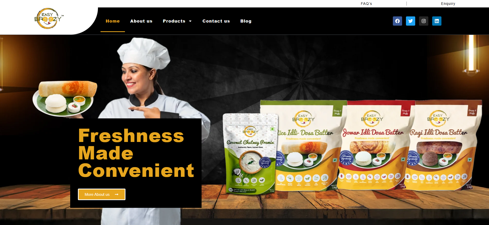

# EasyBrezzy

### 📚   Client Overview

Easy Breezy is a wellness-oriented food company committed to making fresh, preservative-free solutions available for the modern kitchen. With expertise in traditional Indian chutney premixes and batters, Easy Breezy provides consumers with a selection of healthy options such as rice, jowar, and ragi idli dosa batters, which allow people to experience pure flavors without inconvenience.

[Visit Us](https://easybreezyfreshfood.com/)

### 🎯 Objective

Easy Breezy required an effective digital presence that could:

- Display their product range cleanly and attractively.
- Enable simple online ordering and smooth user experience.
- Embody their brand values of freshness, purity, and convenience.

### 🧑🏻‍💻 Technology Stack

- **Platform:** WordPress
- **Builder:** Elementor
- **Theme:** Astra
- **eCommerce:** WooCommerce
- **Backend:** PHP & MySQL

All of these technologies have been picked to allow maximum flexibility, performance, and ease of content management for the Easy Breezy team.

### 🚧 Challenges

- **Product Education:** Being a niche product offering, educating first-time visitors on the health benefits and applications of the batters and chutneys was a necessity.
- **Visual Attraction:** Expressing freshness and purity by communicating it through the website appearance.
- **User Interface:** Creating a simple and natural ordering process that performs well both on desktop and mobile.
- **Performance:** Achieving high loading speed performance despite having image-rich product presentation.
- **Scalability:** Developing a site capable of adapting to new products and changing business demands.

### 💡Our Solution

We built a fresh, contemporary business site with Elementor and Astra theme, which was both performance-optimized and aesthetically pleasing. Main features involved:

- **Product-Oriented Design:** Crisp images and concise descriptions to emphasize freshness and genuineness.
- **WooCommerce Integration:** A smooth eCommerce experience where customers can browse, add to cart, and check out with ease.
- **Mobile Optimization:** A responsive design that provides great usability across all platforms.
- **Blog/Content Sections:** For SEO support and providing value-added tips and recipes in the future.
- **Speed Optimization:** Caching and image compression methods to provide quick page loads.

### 📈 Results

- **Higher Engagement:** Users are spending more time looking at products.
- **More Sales:** Order-online-and-pick-up-in-store became more convenient, driving direct-to-store purchases.
- **Improved Mobile Experience:** Mobile traffic recorded increased conversions as a result of fluid, responsive design.
- **More Brand Presence:** The website now embodies Easy Breezy's fundamental brand attributes—fresh, healthy, and convenient.
